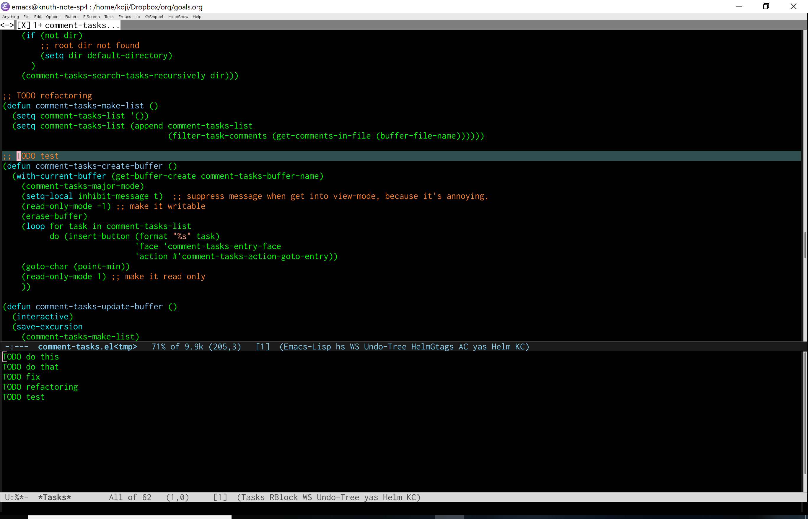

# comment-tasks.el 

## Introduction
`comment-tasks.el` Show tasks in comments in code.

## Screenshot



## Installation

To use this package, put this on your directory where is added to load path,
and add these lines to your init.el or .emacs file:

(require 'comment-tasks)

## Basic Usage

### `comment-tasks-minor-mode`

Enable `comment-tasks-minor-mode`. It searches comments on current buffer,
and if a comment have a keyword defined in comment-tasks-keyword-list,
the comment is displayed on comment-tasks buffer.
A comment on comment-tasks buffer, simply called 'task'.

### `comment-tasks-major-mode`

On comment-tasks buffer, comment-tasks-major-mode is enabled.
You can use these commands on that mode.

#### Default Key Mapping

| Key        | Description                                            |
|:-----------|:------------------------------------------------------:|
| RET        | Jump to the point of the task where cursor focuses     |
| C-j        | Display the point of the task where cursor focuses     |
| j          | Move cursor to next line                               |
| k          | Move cursor to previous line                           |
| q          | Quit the window                                        |

## Customize Variables

#### `comment-tasks-keyword-list`(Default `'("TODO")`)

The keyword list. If the comment contains word that matches one in this list, 
it's displayed on buffer.

#### `comment-tasks-auto-update`(Default `t`)

If this value is non-nil, comment-tasks buffer is updated on after-save-hook.

#### `comment-tasks-list-size`(Default `0.3`)

Size (height or width) for the comment-tasks buffer.

#### `comment-tasks-list-position`(Default `below`)

Position of the comment-tasks buffer.
Either 'right, 'left, 'above or 'below. This value is passed directly to `split-window'.

#### `comment-tasks-focus-after-activation`(Default `nil`)

If this value is non-nil, the cursor is moved to the comment-tasks buffer automatically when
`comment-tasks-minor-mode' is activated.

## Sample Configuration

```lisp
;;; Enable helm-gtags-mode
(add-hook 'c-mode-hook 'helm-gtags-mode)
(add-hook 'c++-mode-hook 'helm-gtags-mode)
(add-hook 'asm-mode-hook 'helm-gtags-mode)

;; customize
(setq comment-tasks-keyword-list '("TODO" "WAITING"))
(setq comment-tasks-auto-update t)
(setq comment-tasks-list-size 0.4)
(setq comment-tasks-list-position 'right)
(setq comment-tasks-focus-after-activation nil)

```
